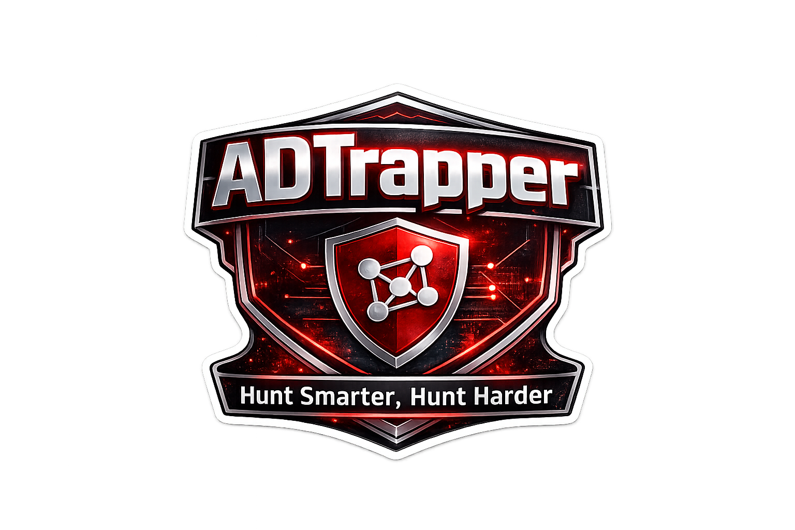

<div align="center">
  
</div>


# ADTrapper - Active Directory Security Analysis Platform


<div align="center">
  


[](https://github.com/MHaggis/ADTrapper/actions/workflows/ci.yml)
[](https://github.com/MHaggis/ADTrapper/actions/workflows/security.yml)

**Professional Active Directory Security Analysis and Threat Detection Platform**

*Transform Windows authentication logs into actionable security insights with advanced threat detection and interactive visualizations*

</div>

## Overview

ADTrapper is a comprehensive security analysis platform designed for cybersecurity professionals to analyze Windows Active Directory authentication logs. The platform provides advanced threat detection, anomaly analysis, and interactive visualizations to help identify and investigate security incidents.

### Key Features

- **[54+ Detection Rules](src/analytics/rules/)** - Brute force, password spray, privilege escalation, ADCS attacks, and more
- **Interactive Visualizations** - Force-directed graphs for network relationships
- **SharpHound Integration** - Upload BloodHound collection data for AD analysis
- **No Authentication Required** - Anonymous uploads, start analyzing immediately
- **Self-Contained Docker Deployment** - Single command to get running

## Quick Start

### Prerequisites
- Docker and Docker Compose
- Git

### 1. Clone and Configure

```bash
git clone https://github.com/MHaggis/ADTrapper.git
cd ADTrapper

# Copy the example environment file
cp env.example .env

# (Optional) Generate a secure password for production
# echo "POSTGRES_PASSWORD=$(openssl rand -base64 32)" >> .env
```

### 2. Start the Services

```bash
# Option 1: Use the deployment script (recommended)
./deploy.sh

# Option 2: Manual startup
docker-compose up -d
docker-compose exec -T database psql -U postgres < supabase/migrations/0001_simple_setup.sql
```

### 3. Access the Application

- **Application**: http://localhost:3000
- **Database**: localhost:54325 (if needed for direct access)

No authentication required - start uploading logs immediately!

## Data Collection

### Windows Authentication Logs

Use the included PowerShell script to collect authentication logs. Run as Administrator for full access:

```powershell
# Show help and all options
Get-Help .\capture.ps1 -Detailed

# Basic collection (last 24 hours)
.\capture.ps1

# Extended collection with AD enrichment
.\capture.ps1 -Hours 48 -EnrichWithAD

# Include AD CS certificate events (for ADCS attack detection)
.\capture.ps1 -ADCS -EnrichWithAD

# Full collection with raw CA database analysis (CA servers only)
# WARNING: This stops the Certificate Authority service temporarily!
.\capture.ps1 -ADCS -RawDatabase -EnrichWithAD

# Export as CSV instead of JSON
.\capture.ps1 -Hours 24 -Format csv -OutputPath C:\Logs\events.csv
```

### Collector Features

| Flag | Description |
|------|-------------|
| `-Hours` | Time range to collect (default: 24, max: 8760) |
| `-OutputPath` | Output file path (default: `.\adtrapper_events.json`) |
| `-Format` | Output format: `json` or `csv` |
| `-EnrichWithAD` | Add user context (department, groups, privileges) |
| `-ADCS` | Collect AD CS events for certificate attack detection |
| `-RawDatabase` | Deep ESC1 analysis via CA database (requires confirmation) |

### Supported Event Types

**Authentication Events:**
- **4624/4625**: Logon success/failure
- **4634/4647**: Logoff events
- **4648**: Explicit credential use
- **4768/4769/4771**: Kerberos authentication
- **4776**: NTLM authentication
- **4740/4742**: Account lockout/changes

**AD CS Events (with `-ADCS`):**
- Certificate requests and issuance
- Template modifications
- CA security changes
- ESC1-ESC11 attack indicators

**SMB Events:**
- **5140/5145**: Share access and enumeration

### SharpHound Integration

ADTrapper supports SharpHound data for comprehensive AD analysis:

```powershell
SharpHound.exe -c All -d YOURDOMAIN.COM --outputdirectory C:\Temp\
```

Upload the generated ZIP file to ADTrapper for automatic analysis.

## Container Management

```bash
# View status
docker-compose ps

# View logs
docker-compose logs -f app
docker-compose logs -f database

# Restart services
docker-compose restart

# Stop services
docker-compose down

# Fresh deployment (WARNING: deletes all data)
./deploy-fresh.sh
```

### Database Backup & Restore

```bash
# Backup
docker-compose exec database pg_dump -U postgres postgres > backup.sql

# Restore
docker-compose exec -T database psql -U postgres postgres < backup.sql
```

## Configuration

### Environment Variables

See `env.example` for all available options:

| Variable | Default | Description |
|----------|---------|-------------|
| `POSTGRES_PASSWORD` | `postgres` | Database password |
| `NEXT_PUBLIC_SUPABASE_URL` | `http://localhost:3001` | REST API URL |
| `NEXT_PUBLIC_APP_URL` | `http://localhost:3000` | Application URL |
| `NODE_ENV` | `development` | Environment mode |

## Troubleshooting

**Database tables not found (500 errors):**
```bash
docker-compose exec -T database psql -U postgres < supabase/migrations/0001_simple_setup.sql
```

**Port conflicts:**
```bash
lsof -i :3000
lsof -i :54325
```

**Application not responding:**
```bash
docker-compose logs app
docker-compose restart
```

## Production Deployment

For production deployments:

1. Set a secure `POSTGRES_PASSWORD` in your `.env` file
2. Enable HTTPS with proper SSL certificates
3. Configure firewall rules to restrict database access
4. Set up regular database backups
5. Consider using a reverse proxy (nginx, traefik)

### Cloud Deployment Options

- AWS ECS/Fargate with RDS PostgreSQL
- Google Cloud Run with Cloud SQL
- Azure Container Instances with PostgreSQL
- DigitalOcean App Platform

## Tech Stack

- **Frontend**: Next.js 14, TypeScript, Tailwind CSS
- **Backend**: Node.js 20 LTS, PostgreSQL 15
- **Deployment**: Docker containers with Docker Compose
- **Visualization**: Custom Canvas with force simulation
- **CI/CD**: GitHub Actions with automated testing and security scans

## Contributing

We welcome contributions:

1. Fork the repository
2. Create a feature branch
3. Make your changes with tests
4. Submit a pull request

## License

Apache License 2.0 - see [LICENSE](LICENSE) file

---

<div align="center">

**Built by security professionals, for security professionals**

*ADTrapper - Advancing Active Directory Security Analysis*

</div>
